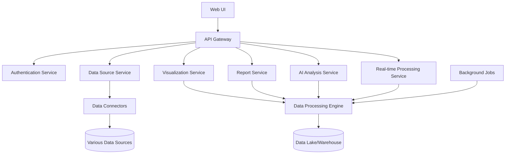

# DataVinci

DataVinci is a comprehensive data management and visualization tool designed for the developer community. It enables users to visualize data from various sources, generate insights, analyze data with AI models, and receive real-time updates on anomalies.

## Table of Contents
- [Features](#features)
- [Architecture](#architecture)
- [Getting Started](#getting-started)
- [Development](#development)
- [Deployment](#deployment)
- [Contributing](#contributing)
- [License](#license)

## Features

- Multi-source data integration (PostgreSQL, MongoDB, Cassandra, Elasticsearch, various logs)
- Interactive data visualization with customizable dashboards
- AI-powered data analysis and anomaly detection
- Real-time data processing and alerts
- Cloud resource management and visualization (e.g., Amazon S3)
- Report generation and scheduling
- Collaboration features with version control

## Architecture

DataVinci follows a microservices architecture for scalability and maintainability. Here's a high-level overview of the system:



## Getting Started

### Prerequisites

- Go 1.16+
- Node.js 14+
- Docker and Docker Compose
- Kubernetes cluster (for production deployment)

### Installation

1. Clone the repository:

```bash
git clone https://github.com/doziestar/datavinci.git
cd datavinci
```

2. Install the required dependencies:

```bash
go mod download
cd web && yarn install && cd ..
```

3. Set up the environment variables:

```bash
cp .env.example .env
# Edit .env with your configuration
```

4. Start the development server:

```bash
docker-compose up -d
go run cmd/datavinci/main.go
```

5. Access the web UI at `http://localhost:3000`.

## Development

DataVinci uses a monorepo structure with Go workspaces (go.work) for backend services and Next.js with Tauri for the frontend.

### Folder Structure

```bash
datavinci/
├── cmd/
│   └── datavinci/
│       └── main.go
├── internal/
│   ├── auth/
│   ├── datasource/
│   ├── visualization/
│   ├── report/
│   ├── ai/
│   └── realtime/
├── pkg/
│   ├── common/
│   └── models/
├── web/
│   ├── components/
│   ├── pages/
│   └── public/
├── deployments/
│   ├── docker/
│   └── k8s/
├── scripts/
├── tests/
├── go.work
├── go.mod
├── go.sum
├── package.json
├── docker-compose.yml
├── Dockerfile
└── README.md
```

### Testing

Run the tests with:

```bash
go test ./...
cd web && yarn test && cd ..
```

### Linting

Lint the Go code with:

```bash
golangci-lint run
```

Lint the JavaScript code with:

```bash
cd web && yarn lint && cd ..
```

## Deployment

DataVinci can be deployed on any cloud provider or on-premises infrastructure. For production deployments, we recommend using Kubernetes with Helm charts.

### Docker

Build the Docker image with:

```bash
docker build -t datavinci:latest .
```

### Kubernetes

Deploy the application on a Kubernetes cluster with:

```bash
kubectl apply -f deployments/k8s
```

### Helm

Install the Helm chart with:

```bash
helm install datavinci deployments/helm
```

## Contributing

Contributions are welcome! Please read the [contributing guidelines](CONTRIBUTING.md) before submitting a pull request.

## License

This project is licensed under the MIT License - see the [LICENSE](LICENSE) file for details.
```