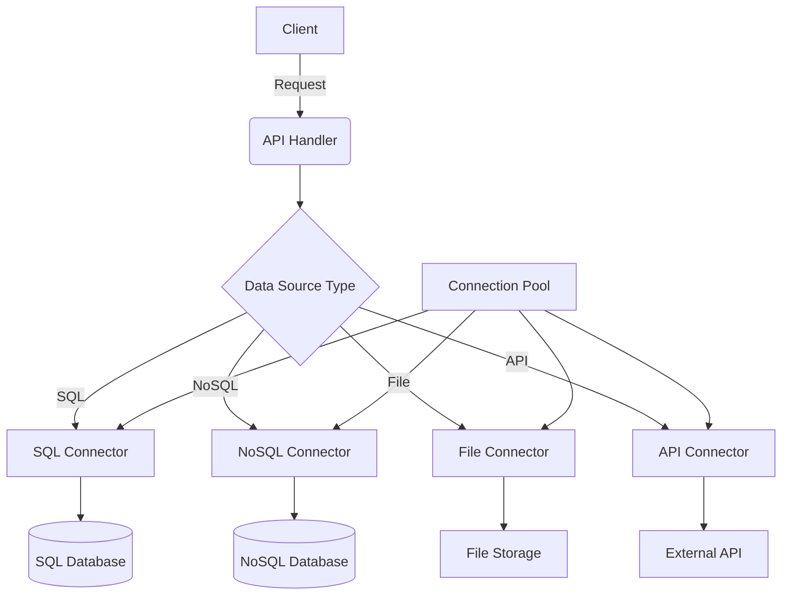
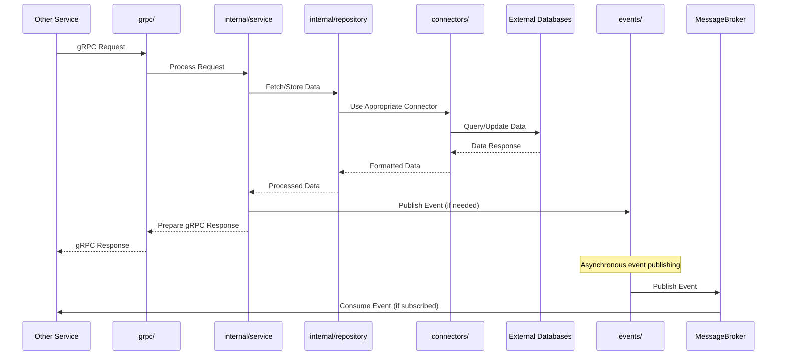

# Data Source Module

## Overview

The Data Source module is the foundation of DataVinci, responsible for managing connections to various data sources and providing a unified interface for data retrieval. This module enables the system to interact with different types of databases, file systems, and APIs.

## Key Features

- Connection management for multiple data source types (SQL, NoSQL, File systems, APIs)
- Unified query interface
- Connection pooling and optimization
- Error handling and retry mechanisms

## Structure

```
internal/datasource/
├── api/
│   └── handlers.go
├── internal/
│   ├── service/
│   │   └── service.go
│   └── repository/
│       └── repository.go
├── models/
│   └── models.go
├── connectors/
│   ├── sql.go
│   ├── nosql.go
│   ├── file.go
│   └── api.go
├── config/
│   └── config.go
└── main.go
```

## Technical Design





## Testing

Run tests using:

```
go test ./internal/datasource/...
```
