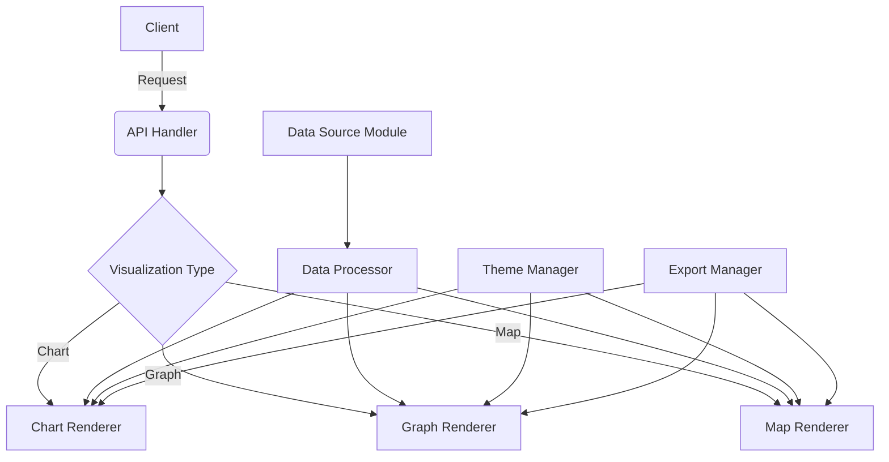

# Visualization Service

## Overview

The Visualization Service is responsible for transforming raw data into meaningful visual representations. It interacts with the Data Source module to fetch data and processes it to create various types of charts, graphs, and interactive visualizations.

## Key Features

- Data processing and aggregation
- Multiple chart types (line, bar, pie, scatter, etc.)
- Interactive visualizations (zooming, filtering, etc.)
- Custom color schemes and theming
- Real-time data updates
- Export functionality (PNG, SVG, PDF)

## Structure

```plainText
visualization/
├── api/
│   ├── handlers/
│   │   └── visualization_handler.go
│   └── proto/
│       └── visualization.proto
├── cmd/
│   └── server/
│       └── main.go
├── internal/
│   ├── service/
│   │   └── visualization_service.go
│   └── processor/
│       ├── data_processor.go
│       └── aggregator.go
├── models/
│   └── visualization.go
├── renderers/
│   ├── chart/
│   │   ├── bar_chart.go
│   │   ├── line_chart.go
│   │   └── pie_chart.go
│   ├── graph/
│   │   ├── network_graph.go
│   │   └── tree_graph.go
│   └── map/
│       ├── choropleth.go
│       └── point_map.go
├── config/
│   └── config.go
├── pkg/
│   ├── colors/
│   │   └── palette.go
│   └── export/
│       └── exporter.go
├── Dockerfile
├── go.mod
├── go.sum
└── Makefile
```

## Technical Design



## API Design

```go
type VisualizationRequest struct {
    DataSourceID string
    VisualizationType string
    Dimensions []string
    Measures []string
    Filters map[string]interface{}
    Options map[string]interface{}
}

type VisualizationResponse struct {
    VisualizationData interface{}
    Metadata map[string]interface{}
}

service VisualizationService {
    rpc CreateVisualization(VisualizationRequest) returns (VisualizationResponse);
    rpc UpdateVisualization(VisualizationRequest) returns (VisualizationResponse);
    rpc GetVisualization(GetVisualizationRequest) returns (VisualizationResponse);
    rpc ListVisualizations(ListVisualizationsRequest) returns (ListVisualizationsResponse);
    rpc DeleteVisualization(DeleteVisualizationRequest) returns (DeleteVisualizationResponse);
    rpc ExportVisualization(ExportVisualizationRequest) returns (ExportVisualizationResponse);
}
```

## Testing

Run tests using:

```bash
go test ./internal/visualization/...
```
